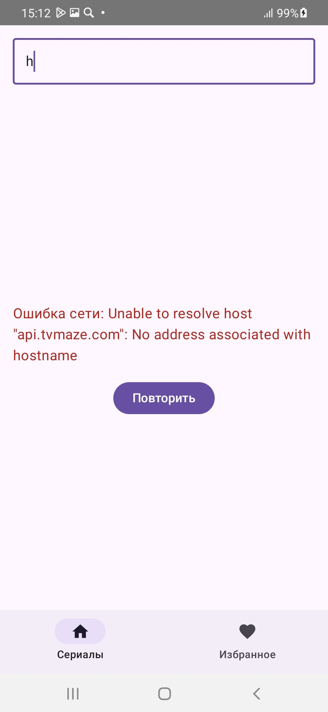
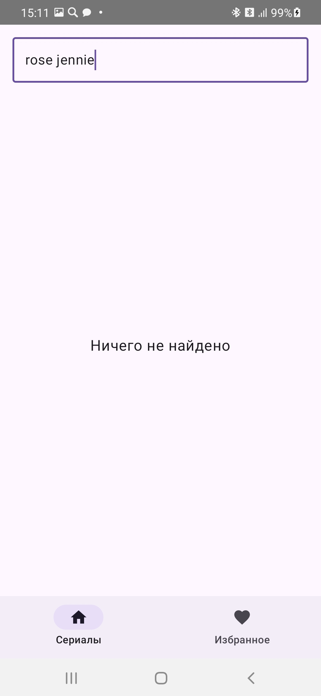
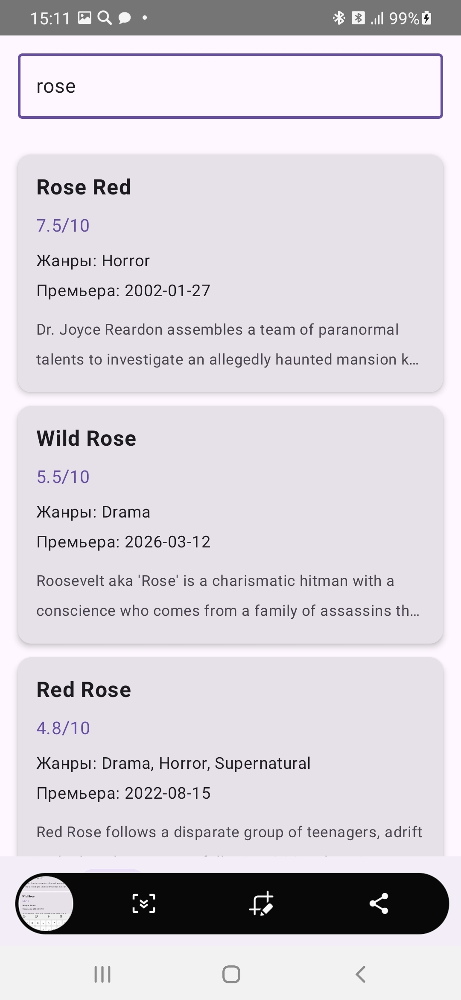
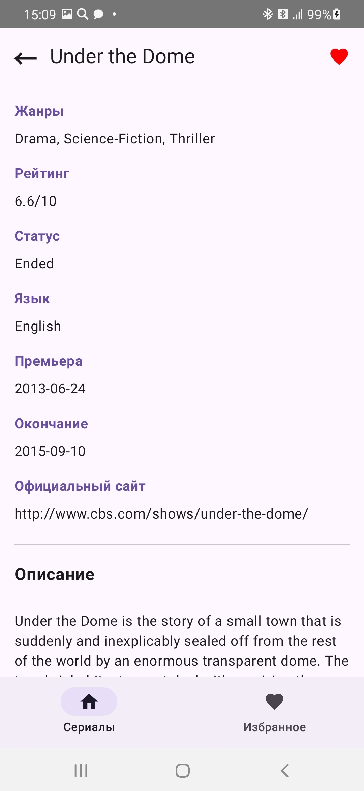
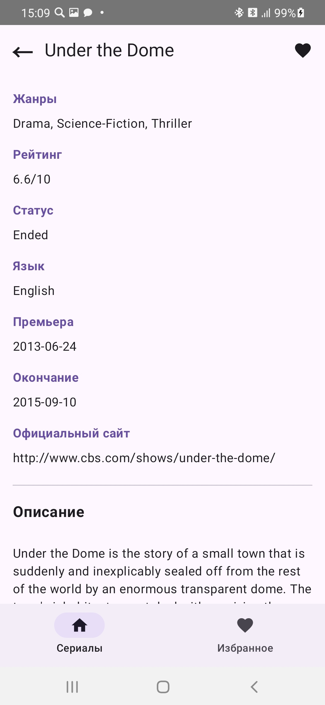

Захарова Сандаара
Б9124-09.03.03

TVmaze API (https://www.tvmaze.com/api)

Что даёт API
-Список сериалов с пагинацией (/shows?page=0)
-Поиск по названию (/search/shows?q=)
-Детальная информация (/shows/{id})

Функционал приложения:
Экраны
-Экран	Описание
-ListScreen	Список сериалов + бесконечная прокрутка
-SearchScreen	Поиск по названию (встроен в ListScreen)
-DetailScreen	Детальная информация + кнопка избранного
-FavouritesScreen	Избранные сериалы (сохраняются в Room)

UI-состояния (все обязательные)
-Loading - CircularProgressIndicator
-Error + Retry - сообщение об ошибке + кнопка "Повторить"
-Empty - "Ничего не найдено" / "Нет избранных сериалов"
-Success - отображение данных

Сценарий: Избранное
-Добавление/удаление через кнопку "лайк" на DetailScreen
-Сохраняется после перезапуска приложения
-Отдельный экран FavouritesScreen
-Повторное добавление не создаёт дубликаты 

DI модули:
NetworkModule - Retrofit, TvMazeApiService
AppModule	- TvMazeDatabase, FavouriteDao

Юнит-тесты
1	initial state should be Loading -	начальное состояние
2	loadShows should return Success state with shows	- успешная загрузка
3	loadShows should return Error state on network failure	- ошибка загрузки
4	retry should reload data after error	retry() - после ошибки
5	empty search result should return Empty state	- пустой результат
6	toggleFavourite should add and remove from favourites	- бизнес-логика
7	loadShowDetails should return Success state with show	- успешная загрузка деталей

Интеграционные тесты
1. addToFavouritesThenGetAllFavouritesShouldReturnAddedShow -	запись в Room
2. addingSameShowTwiceShouldNotCreateDuplicate	- отсутствие дублей
3. removeFromFavouritesShouldRemoveShowFromFavourites -	удаление из Room

Нетривиальные тесты
1. retry should reload data after error	retry() - инициирует новую загрузку
2. addingSameShowTwiceShouldNotCreateDuplicate -	повторное добавление не создаёт дубль

 

