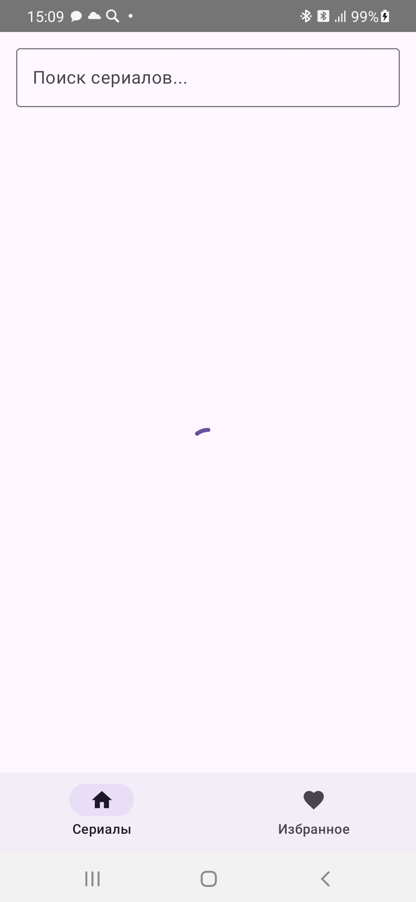

Захарова Сандаара
Б9124-09.03.03

TVmaze API (https://www.tvmaze.com/api)

Что даёт API
-Список сериалов с пагинацией (/shows?page=0)
-Поиск по названию (/search/shows?q=)
-Детальная информация (/shows/{id})

Функционал приложения:
Экраны
-Экран	Описание
-ListScreen	Список сериалов + бесконечная прокрутка
-SearchScreen	Поиск по названию (встроен в ListScreen)
-DetailScreen	Детальная информация + кнопка избранного
-FavouritesScreen	Избранные сериалы (сохраняются в Room)

UI-состояния (все обязательные)
-Loading - CircularProgressIndicator
-Error + Retry - сообщение об ошибке + кнопка "Повторить"
-Empty - "Ничего не найдено" / "Нет избранных сериалов"
-Success - отображение данных

Сценарий: Избранное
-Добавление/удаление через кнопку "лайк" на DetailScreen
-Сохраняется после перезапуска приложения
-Отдельный экран FavouritesScreen
-Повторное добавление не создаёт дубликаты 

DI модули:
NetworkModule - Retrofit, TvMazeApiService
AppModule	- TvMazeDatabase, FavouriteDao

Исправлено:

Юнит-тесты (7 шт.)

1. initial state should be Loading	(ListViewModelTest)	- Проверка начального состояния экрана
2. loadShows should return Success state with shows	(ListViewModelTest) -	Успешная загрузка данных
3. loadShows should return Error state on network failure	(ListViewModelTest) -	Ошибка загрузки
4. retry should reload data after error	(ListViewModelTest) -	Retry после ошибки
5. empty search result should return Empty state	(ListViewModelTest) -	Пустой результат поиска
6. toggleFavourite should add and remove from favourites	(DetailViewModelTest) -	Бизнес-логика избранного
7. loadShowDetails should return Success state with show	(DetailViewModelTest) -	Успешная загрузка деталей

Интеграционные тесты (4 шт.)

1. addToFavouritesThenGetAllFavouritesShouldReturnAddedShow (FavouriteRepositoryIntegrationTest) -	Data-слой (Repository + Room)
2. addingSameShowTwiceShouldNotCreateDuplicateAndShouldUpdateData (FavouriteRepositoryIntegrationTest) -	Data-слой (отсутствие дублей)
3. removeFromFavouritesShouldRemoveShowFromFavourites	(FavouriteRepositoryIntegrationTest) - Data-слой (удаление)
4. clickOnShowShouldNavigateToDetailScreen	(ListScreenNavigationTest) - UI-интеграция (список → клик → детали)

Нетривиальные тесты (3 шт.)

1. retry should reload data after error	(ListViewModelTest)	retry() инициирует новую загрузку
2. addingSameShowTwiceShouldNotCreateDuplicateAndShouldUpdateData	(FavouriteRepositoryIntegrationTest) - Повторное добавление не создаёт дубль и обновляет данные
3. toggleFavourite should add when not favourite and remove when favourite	(DetailViewModelTest) -	Toggle работает в обе стороны

Flow-тесты (2 шт.)

1. loadShows should emit Loading then Success sequence	(ListViewModelFlowTest) -	Полная последовательность эмиссий
2. search should cancel previous request and show only latest result (ListViewModelFlowTest) - Нетривиальное потоковое поведение (отмена устаревшего запроса)

 

